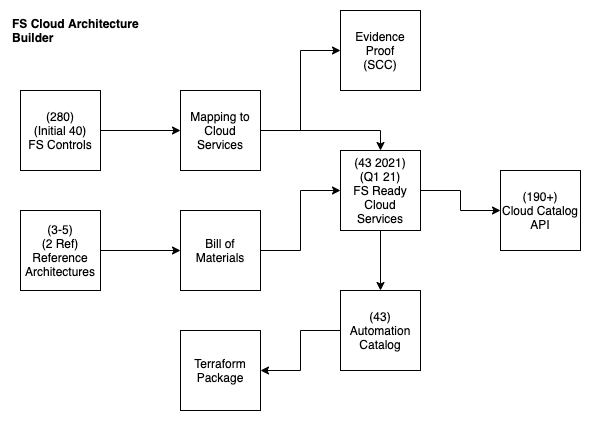
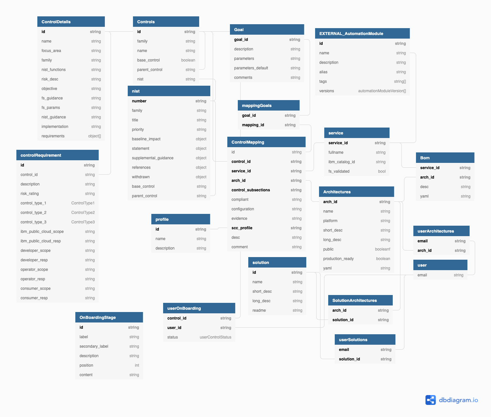

# FS Cloud Architectures

This application backend will enable a collection of APIs that will support the relationship between a 
Reference Architecture and its Bill of Materials(BOM) (list of comprising services). The BOM relationship to 
the list of FS Ready services. The mapping between the cloud services and the FS Controls. Finally you can 
view the FS Controls mapping to the Cloud Services and the supporting refernece Architectures.

Once we have this data model in place, we will be able to link it to the Automation Catalog that is being
built by Asset team,  we will be able to take the BOM and input it into the Solution Builder API they have built
and output a package of consistent terraform.

This will enable the Ecosystem teams including ISVs to have a consistent way of describing reference archtiectures
and having their automation packaged consistently.

This application is generated using [LoopBack 4 CLI](https://loopback.io/doc/en/lb4/Command-line-interface.html) with the
[initial project layout](https://loopback.io/doc/en/lb4/Loopback-application-layout.html).

## Supporting Documentation

List of reference documentation that will support the APIs

- [NIST-800-53](https://nvd.nist.gov/800-53)
- [Cloud Catalog API](https://globalcatalog.cloud.ibm.com/api/v1?_limit=100&complete=false&q=is.volume)
- [Automation Git Repo](https://github.com/ibm-garage-cloud/garage-terraform-modules/blob/main/MODULES.md)
- [Automation Catalog](https://raw.githubusercontent.com/ibm-garage-cloud/garage-terraform-modules/gh-pages/index.yaml)
- [Solution Builder Code]()

## Overview

The Architecture builder's goal is to simplify the complexity of the data attributes that surround a
reference architecture for the FS Cloud. When we review the Financial Controls the number of cloud services
and the possible reference architectures these can be assembled in. It has become clear
a tool will help manage this wide range of attributes.

The following diagram helps describes the key entities and their relationships.



The following diagram describes our database model in details:



## Data

To help speed up the data loading a simple ingestion model has been created. The core
data entities are created in Excel spreadsheets. The first row of the entity holds
the column name or JSON attribute name. To ingest data save the entity in `csv` file 
format. into the `data/source` folder. To then convert the into JSON format
install the following package`

Install the `csvtojson` tool `npm install csvtojson -g`

Then run the script `./convert.sh` this will export the `csv` files into `json` files

### Import to MongoDB

From the `data` folder download the MongoDB certificate into `export DBCERT=~/projects/certs/cloud-mongodb.pem`

From the MongoDB services instance screen in IBM Cloud take the `composed` value and configure
the `URI` environment variable `export URI="mongodb://ibm_cloud_4..`.
For the test database you want to do the same thing with the `URI_TEST` environment variable `export URI_TEST="mongodb://ibm_cloud_4..`.

You can then run `./mload-cloud { $URI | $URI_TEST }` to configure the MongoDB collection with the initial data to 
feed the API.

## Install dependencies

By default, dependencies were installed when this application was generated.
Whenever dependencies in `package.json` are changed, run the following command:

Setup the following environment variables before you can run the application

To run this locally you need to take the mongo binding value that is registered as a 
secret in the OpenShift environment or from the Service Credentials section of a 
managed MongoDB instance. Take the binding value and configure it as a environment value.

A script has been provided to simplify this process. The steps to run the script are as follows:

1. Log into the IBM Cloud account using the ibmcloud cli
2. Find the names of the MongoDB and Object Storage instances:
   
    ```shell
    ibmcloud resource service-instances
    ```
   
3. Source the setup-environment script to create the environment variables, passing the names of the services:
   
    ```shell
    source ./scripts/setup-environment.sh {MONGODB_NAME} {COS_NAME}
    ```
   
4. Verify the environment variables have been created by running the following:

    ```shell
    echo $DATABASE
    echo $STORAGE
    ```

Once this value is set it is now possible to run the application.

```sh
yarn install
yarn start
```

For playing around using the test database:

```sh
export DATABASE_TEST="{connection....}"
NODE_ENV=test yarn start
```

## Run the application

```sh
yarn start
```

You can also run `node .` to skip the build step.

Open http://127.0.0.1:3000 in your browser.

## Rebuild the project

To incrementally build the project:

```sh
yarn run build
```

To force a full build by cleaning up cached artifacts:

```sh
yarn run rebuild
```

## Fix code style and formatting issues

```sh
yarn run lint
```

To automatically fix such issues:

```sh
yarn run lint:fix
```

## Other useful commands

- `yarn run migrate`: Migrate database schemas for models
- `yarn run openapi-spec`: Generate OpenAPI spec into a file
- `yarn run docker:build`: Build a Docker image for this application
- `yarn run docker:run`: Run this application inside a Docker container

## Tests

```sh
export DATABASE_TEST="{connection....}"
yarn test
```

### redis (install on mac)
1) brew install redis
2) brew services start redis
3) redis-cli
4) SET "Key" "value"
5) GET Key
6) brew services stop redis

## What's next

Please check out [LoopBack 4 documentation](https://loopback.io/doc/en/lb4/) to
understand how you can continue to add features to this application.

[-@2x.png)](http://loopback.io/)
